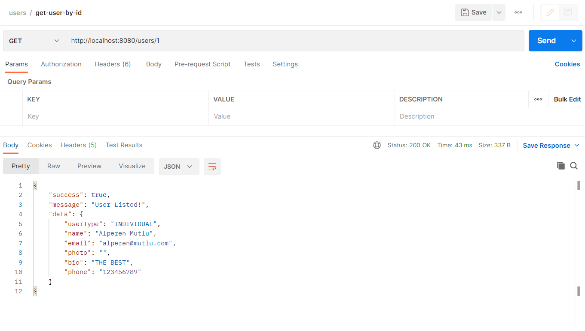

# HepsiEmlak-FinalProject

This project is for who is looking for real estates and who is looking for to sell/rent real estates.

## Used Technologies

**Backend:** Java 11, Spring Boot, Maven, Hibernate, JUnit5

**Database:** MySQL

# Screen Shots

## Users

### Save User
### end point : http://localhost:8080/users


### User advert number is 0 at first!


### Get User By ID
### end point : http://localhost:8080/users/{id}
#### normally only authorized users can perform it.



### Get User's Product by User Id
### end point : http://localhost:8080/users/products/{userId}


### Get All Users
### end point : http://localhost:8080/users


## Auth
### end point : http://localhost:9090/auth


## Products
### Save Product
### end point : http://localhost:8080/products
#### normally only authorized users can perform it.


### Get All Products
### end point : http://localhost:8080/products
#### normally only authorized users can perform it.


### Get Product By Name
### end point : http://localhost:8080/products/{productName}
#### normally only authorized users can perform it.


## User Product Detail

### Save Product To User
### end point : http://localhost:9090/userProductDetail/{productId}/{userId}


### After product added to User
### User's advert number updated.


## User's Product Detail
### User bought the product once. If user buy the product again, "end date" will be upadated remain time plus 30 days. Purchase date will be updated also.
### And User's advert rights will be updated remain rights plus 10 rights.


## Payment
### Also payment done at the same time when product added to user.


## Adverts

### Add Advert
### end point : http://localhost:9090/adverts
#### Only authenticated users can perform it.


### Get Advert By Advert No
### end point : http://localhost:8080/adverts/{advertNo}


### Get All Adverts
### end point : http://localhost:8080/adverts


### Update Advert By Id
### end point : http://localhost:9090/adverts/update/{advertId}


### Delete Advert By Id
### end point : http://localhost:9090/adverts/delete/{advertId}


### Get Active Adverts By User Id
### end point : http://localhost:9090/adverts/active/user/{userId}


### If User's Advert Right Is 0


### If User try to add an advert when User's advert rights are over.  


#

## Installing & Running

Clone this repo into your local:

```bash
  git clone https://github.com/alperenmutlu/HepsiEmlak-FinalProject.git
```

Build using maven

```bash
  mvn clean install
```

Start the app

```bash
  mvn spring-boot:run
```

#

# Diagram


#

# EmlakBurada-master Database Diagram


